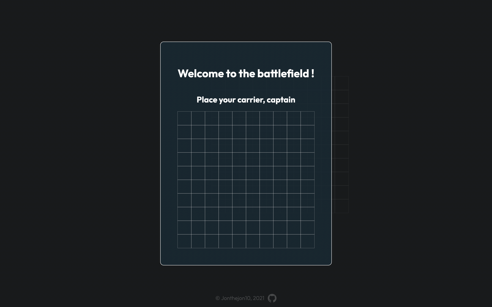
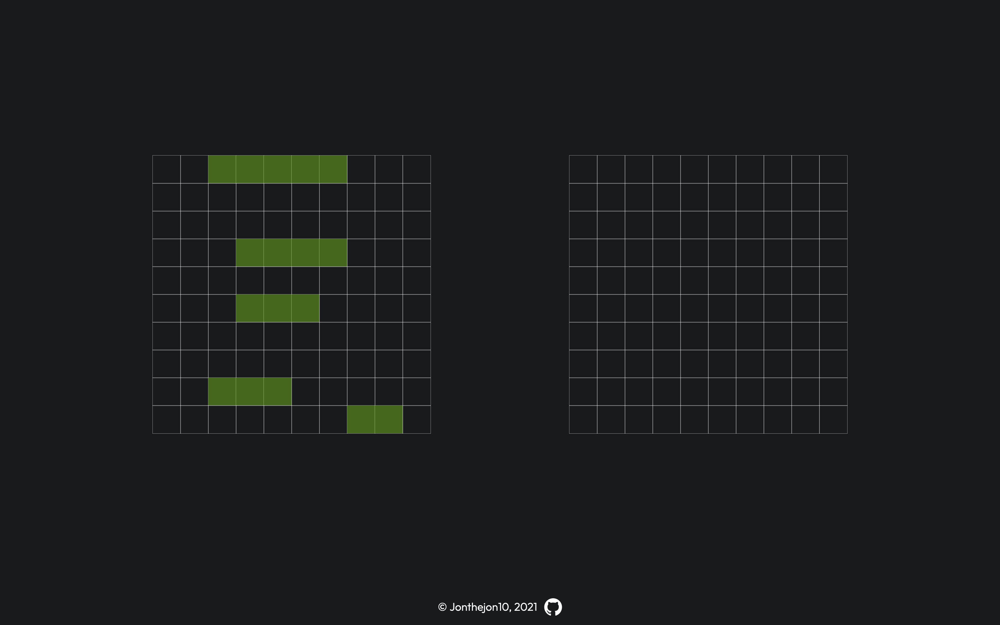

# Battleship project 
## Made with HTML, CSS, JS, Webpack, ESLINT and Jest.

This is where I first started working with tests through jest

<a href="https://ionutianchis.github.io/Battleship/">Live preview</a>

